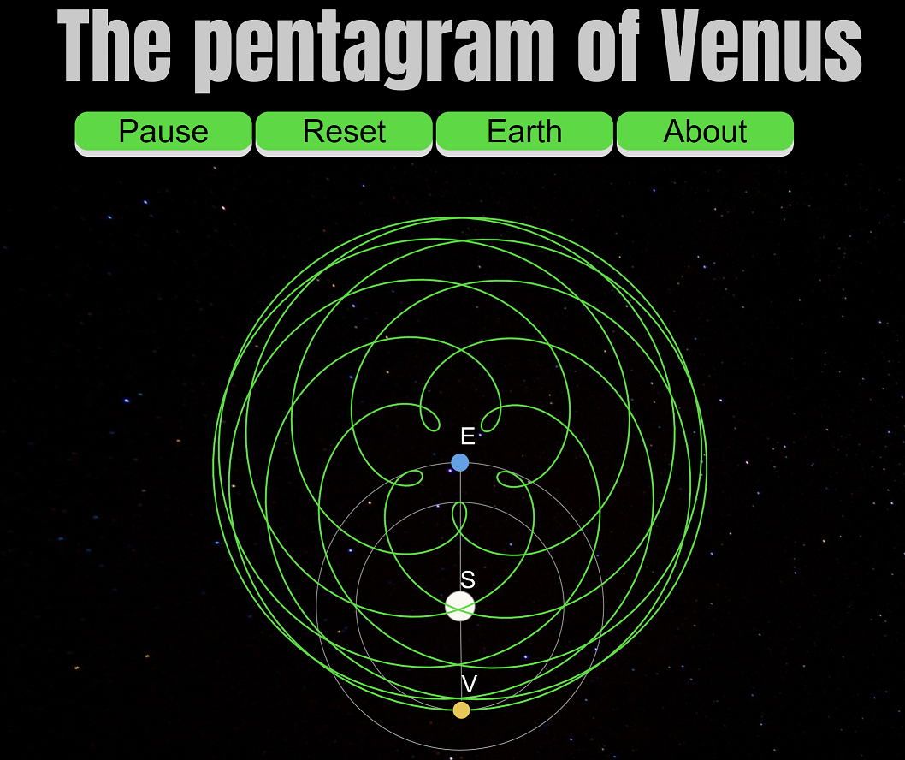

 
 
Venus's orbit draws a curious figure when we look from an Earth viewpoint. This figure, well known since ancient times, is usually called the Pentagram of Venus, due to the 5 lobes that can be observed. This JavaScript implementation uses the [p5.js](https://p5js.org/) library to dynamically create the pentagram.
